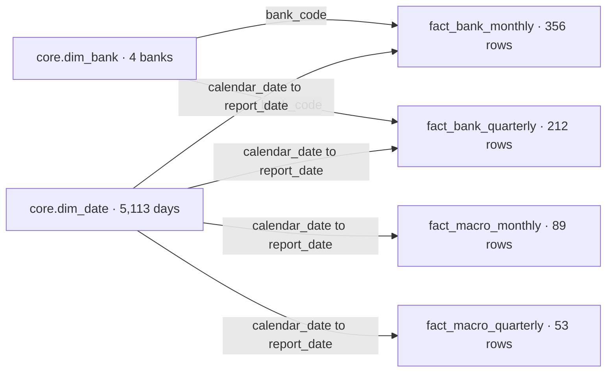

# Analysis model: grains, periods and date joins

Initial decisions from step 6A, confirmed on 2026-09-13 after commit `1f5bedd`. All six source modules, all three project outputs from [19_check_model_joins.sql](../sql/19_check_model_joins.sql), the shared date dimension, all four facts and the integrated model checks are confirmed. Power BI configuration and reporting remain subsequent work.

## Reporting scope

The first report will describe the four banks' monthly domestic-book assets, loans and deposits, with monthly interest-rate and headline CPI context. A quarterly view will describe their reported consolidated capital and liquidity measures alongside quarterly macro context. CPI expenditure detail is a later extension after the core report works.

Use each bank dataset's complete validated history. Do not shorten all analysis to the period where monthly CPI is available. Clearly label each view's latest observation date: the monthly bank snapshot ends in July 2026, while the quarterly snapshot ends in March 2026.

The raw and staging tables retain their existing full histories. The initial macro analysis facts use the distinct periods required by the corresponding bank fact, so later macro observations do not imply the availability of later bank observations.

## Facts and their logical keys

All four facts are created and individually confirmed in the project.

| Object | One row represents | Logical key | Initial coverage and rows |
|---|---|---|---|
| `mart.fact_bank_monthly` | One bank at one monthly reporting date | bank_code, report_date | 4 banks × 89 months = 356 rows; 2019-03-31 to 2026-07-31 |
| `mart.fact_bank_quarterly` | One bank at one quarterly reporting date | bank_code, report_date | 4 banks × 53 quarters = 212 rows; 2013-03-31 to 2026-03-31 |
| `mart.fact_macro_monthly` | One observation month shared by all banks | report_date | 89 monthly rows, anchored to distinct monthly bank dates; RBA rates and available Table 1 headline CPI |
| `mart.fact_macro_quarterly` | One observation quarter shared by all banks | report_date | 53 quarterly rows, anchored to distinct ADI dates; derived RBA quarterly means and Table 17 headline CPI |

Macro facts do not have a bank key. A bank selection filters banking observations; a date selection filters both bank and macro observations. A missing CPI value remains a field-level NULL in an existing macro-period row. It does not remove that bank or date from the model.

This uses the separation between filtering dimensions and facts with consistent grains described in [Microsoft's Power BI star-schema guidance](https://learn.microsoft.com/en-us/power-bi/guidance/star-schema). The specific object names, reporting windows and rate calculation below are project design choices.

## Dimensions and filtering

Reuse `core.dim_bank` as the four-bank dimension, with `bank_code` as its relationship key. The confirmed daily `core.dim_date` covers full calendar years 2013-2026, with date, year, quarter, month and sortable period labels. Its date key will link to the month-end or quarter-end dates used by the facts.

Configure one-to-many relationships with filtering from dimensions to facts. The date dimension filters all four core facts, while the bank dimension filters the two banking facts. Do not link the fact tables directly. This follows the relationship roles in [Microsoft's model relationship guidance](https://learn.microsoft.com/en-us/power-bi/transform-model/desktop-relationships-understand).

The diagram shows the intended filter direction. The SQL tables and their key coverage are validated; these Power BI relationships have not yet been configured.

Use year/month fields on monthly views and year/quarter fields on quarterly views. A quarterly fact has observations only at quarter ends; a February-only date selection does not represent a complete quarterly observation. Keep page frequency clear rather than repeating quarterly observations into each month.

Table 18 remains available in `stg.abs_cpi_australia_quarterly_detail`. A later detail fact will retain the `(series_id, report_date)` grain and use a series dimension carrying category, metric and unit. It will not join all 396 series onto every bank-quarter row. If its full 1948-2026 history is exposed, extend the date dimension to cover it; the initial 2013-2026 calendar only supports the core bank reporting period. Category names are not unique keys, and reporting hierarchy levels still require an explicit mapping.

## Monthly alignment and coverage

Use exact month-end date equality between MADIS, RBA monthly rates and Table 1 monthly CPI. RBA fields remain monthly averages even though their date keys are month ends. CPI dates label observation months, not publication dates.

| Monthly macro measure | Required months | Numeric months | Unavailable months |
|---|---:|---:|---:|
| Cash-rate target | 89 | 89 | 0 |
| Interbank cash rate | 89 | 89 | 0 |
| Three-month bank-bill rate | 89 | 89 | 0 |
| CPI index | 89 | 28 | 61 |
| CPI published YoY | 89 | 16 | 73 |
| CPI published MoM | 89 | 27 | 62 |

Monthly CPI index coverage starts in April 2024, published MoM in May 2024 and published YoY in April 2025, all ending in July 2026. Preserve the earlier banking observations and mark unavailable macro values. Do not interpolate CPI, carry later observations backward, or fill monthly gaps with quarterly CPI.

The read-only trial uses bank-driven LEFT JOINs to measure the effect of joining dates. It must retain 356 bank-month rows and produce no duplicate bank-month keys. It is a diagnostic query, not a proposed combined Power BI fact. A missing macro month appears on four bank rows: the 61 unavailable index months correspond to 244 bank rows, while YoY and MoM correspond to 292 and 248 bank rows respectively. These counts must not be mistaken for numbers of distinct macro months.

## Quarterly alignment and rate definition

Keep ADI's quarterly observations at their validated quarter-end dates and match Table 17 by exact date. Retain `entity_quarter_end` and `capital_framework` from ADI. The monthly MADIS scope and quarterly ADI scope remain separate; do not combine domestic loans with consolidated RWA to construct a cross-source ratio.

For quarterly macro context, define each RBA rate as the **equal-weight arithmetic mean of the quarter's three monthly averages**:

`quarterly_mean_pct = (month_1_pct + month_2_pct + month_3_pct) / 3`

This is a project-derived statistic. It is not an official quarterly RBA series, a quarter-end spot rate or a daily-weighted quarterly average. Use explicit names `cash_rate_target_qtr_mean_pct`, `interbank_cash_rate_qtr_mean_pct` and `bank_bill_3m_qtr_mean_pct`. Retain per-cent units and store the derived result at six decimal places.

The calculation requires exactly three source rows representing three distinct months, each with a valid month-end label. Each rate also needs three non-NULL values. If a rate fails that requirement, its quarterly result is NULL; other complete rates may remain populated. [DuckDB documents that AVG excludes NULL inputs](https://www.duckdb.org/docs/current/sql/functions/aggregates), so the completeness conditions are necessary to avoid silently treating a two-month average as a complete quarter.

All 53 ADI quarters have complete monthly inputs for all three rates. All 53 also have numeric Table 17 CPI index and published QoQ. The trial quarterly joins must preserve 212 bank-quarter rows with no duplicated keys or unavailable selected macro values. Incomplete RBA quarters outside the required ADI range do not enter the initial quarterly macro fact.

Preserve the published quarterly CPI and QoQ; do not calculate them by averaging monthly percentage changes. Table 18's All groups index and QoQ duplicate the shared headline observations from Table 17, so they are not additional observations for an aggregate.

## Initial measure rules

| Measure family | Reporting rule |
|---|---|
| Assets, loans, deposits and capital/RWA amounts | Retain AUD millions. Sum banks at a common date when the measure and scope match. Across dates, show the period's endpoint balance rather than a sum of balances. |
| Monthly loan/deposit changes | Calculate within a bank using the exact prior month or prior-year month. Preserve NULL when the comparison period is absent; define percent changes separately from absolute changes. |
| Share among the Big Four | Use the same-date total for all four mapped banks as the denominator. Label it as a Big Four share, not an industry-wide market share. |
| Published capital/liquidity ratios | First report them by bank and quarter. Preserve fractions for percentage display; do not sum or use an unlabelled simple average across banks. |
| RBA and CPI change values | Source `_pct` values use per-cent units. Convert once to fractions if applying percentage formatting; never sum rates across banks. |
| CPI indexes and contributions | Keep index numbers, percentage changes and index points distinct. Do not sum overlapping groups, subgroups and classes. |

The first monthly measures can use the seven audited MADIS amounts, with housing loans formed from owner-occupied and investment housing loans. Business loans must retain the narrower source meaning of loans to non-financial businesses. Later measure SQL and DAX must be checked against selected bank/date examples before use in report cards.

Preserve ADI's earlier liquidity NULLs and its 2023 capital-framework label. That label identifies a reporting break; it does not adjust the history for comparability. Charts can describe concurrent patterns between banking and macro series. Observation-period dates and the pinned snapshots do not provide release-time availability or causal evidence.

## Step 6A execution and acceptance

Run the three complete numbered statements in [19_check_model_joins.sql](../sql/19_check_model_joins.sql), in order, on the existing project connection. They read only the six staging tables, create no database objects and do not read the Excel files again.

| Section | Expected project result |
|---|---|
| 1: input grains | Six PASS rows; row/period counts 356/89, 212/53, 687/687, 28/28, 312/312 and 123552/312; duplicate and invalid key counts all zero |
| 2: monthly trial joins | Nine PASS rows; 356 rows before and after; CPI missing counts 244 for unmatched months/index, 292 for YoY and 248 for MoM; other issue counts zero |
| 3: quarterly trial joins | Ten PASS rows; 53 required quarters, 212 bank rows before and after; other issue counts zero |

Read all three outputs together. The input check verifies source-key uniqueness, valid period labels and the pinned history; the join checks test cardinality and coverage. A successful join alone is not a new source audit or an economic finding. Update the pinned expectations deliberately when adopting another source snapshot.

## Independent validation

The exact script was tested in a fresh in-memory DuckDB v1.5.5 database after rebuilding all six staging inputs from the existing SQL scripts and pinned workbooks. All six input checks, nine monthly checks and ten quarterly checks passed. Independent Decimal arithmetic matched all **159 derived rate values** across the 53 ADI quarters at six decimal places.

Four temporary fault scenarios tested a duplicated RBA month, a missing RBA month, a NULL cash rate in an otherwise complete quarter and a duplicated monthly CPI observation. The joins exposed extra or unmatched bank rows; the guarded quarter calculation withheld incomplete rates while retaining complete ones. Each temporary change was rolled back inside the test database.

The tests used the installed Excel extension, left the source workbooks unchanged and did not open the populated project database. A fresh extension download was not tested.

## Confirmed model steps and next step

Three DBeaver screenshots on 2026-09-13 confirmed all expected project results: the six input-grain checks at 16:44:28, the nine monthly-join checks at 16:44:54, and the ten quarterly-join checks at 16:45:10. All statuses were PASS. The monthly joins retained 356 rows and the quarterly joins retained 212 rows; the expected monthly CPI NULLs remained visible. The project script matches the independently tested version.

[20_create_date_dimension.sql](../sql/20_create_date_dimension.sql) is confirmed in the project for step 6B: 5,113 daily records across 2013-2026, a `calendar_date` primary key, 12 required calendar attributes, 13 passing calendar checks and five passing coverage rows. See the [date-dimension notes](date_dimension.md) for the four confirmed screenshots.

[21_create_fact_bank_monthly.sql](../sql/21_create_fact_bank_monthly.sql) is confirmed in the project for step 6C: nine fields with a composite primary key, all 356 bank-month observations and seven amounts, 14 passing integrity checks and two passing staging comparisons with zero differences. See the [monthly bank fact notes](fact_bank_monthly.md) for the four confirmed screenshots.

[22_create_fact_bank_quarterly.sql](../sql/22_create_fact_bank_quarterly.sql) is confirmed in the project for step 6D: 14 fields and 212 bank-quarter records, both dates, ten measures with their existing NULLs and the framework label. All 21 integrity checks and both full-record comparisons passed. See the [quarterly bank fact notes](fact_bank_quarterly.md).

[23_create_fact_macro_monthly.sql](../sql/23_create_fact_macro_monthly.sql) is confirmed in the project for step 6E: seven fields, 89 monthly observations, 20 passing integrity checks and two source comparisons with zero differences. CPI missing counts remain 61/73/62, counted once per month. See the [monthly macro fact notes](fact_macro_monthly.md).

[24_create_fact_macro_quarterly.sql](../sql/24_create_fact_macro_quarterly.sql) is confirmed in the project for step 6F: six fields, 53 bank quarters, 17 passing integrity checks and two full-record comparisons with zero differences. All 265 values are populated in the pinned snapshot. The three mean fields allow NULL when inputs are incomplete, and completeness checks flag that condition. See the [quarterly macro fact notes](fact_macro_quarterly.md).

[25_validate_analysis_model.sql](../sql/25_validate_analysis_model.sql) is confirmed in the project for step 6G. Its six table-inventory rows, six intended dimension relationships and two combined trial joins all passed. Monthly and quarterly bank joins retained 356 and 212 rows respectively, with no unmatched rows or duplicate bank-period groups. The individual schema, period and value audits remain the evidence for each table's contents. See [model validation](model_validation.md) for the confirmed screenshots and [model rebuild](rebuild_analysis_model.md) for execution order. The next reporting stage will import these tables and configure and validate the Power BI model.
