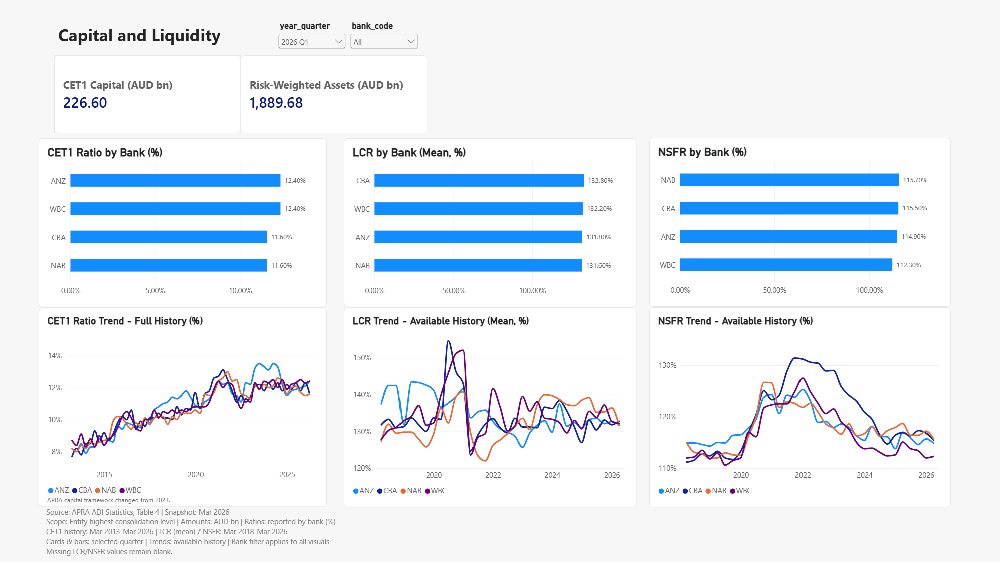

# Power BI Capital & Liquidity

The fourth report page was accepted on 17 September 2026. It contains two
amount cards, three bank comparisons and three bank-level history charts,
using five validated measures. The author confirmed numerical and interaction
checks, restored 2026 Q1 / All, adjusted the final layout and saved the report.
All four planned Power BI pages and seventeen measures are now accepted;
the final project release review remains in progress.

## Data and definitions

This page uses `fact_bank_quarterly`, `dim_bank` and `dim_date`. Its pinned
APRA ADI Table 4 input has one bank per publication-quarter reporting date:
212 observations, four banks and 53 quarters, March 2013-March 2026. Reporting
dates label periods, not release timestamps. This is a fixed snapshot, not a
live feed. See the [quarterly fact dictionary](fact_bank_quarterly.md) and
[ADI staging notes](apra_adi_staging.md).

The source uses each entity's highest consolidation level. Its capital and
liquidity measures have a different scope from monthly MADIS domestic,
unconsolidated resident balances. The shared bank dimension does not make
these scopes interchangeable.

| Measure and checked query | Source field | Reporting behavior |
|---|---|---|
| [CET1 Capital (AUD bn)](../powerbi/dax/13_cet1_capital.dax) | `cet1_capital_million` | Sum selected banks at one fact date; divide AUD million by 1,000 |
| [Risk-Weighted Assets (AUD bn)](../powerbi/dax/14_risk_weighted_assets.dax) | `rwa_million` | Same date and unit rule for RWA |
| [CET1 Ratio (%)](../powerbi/dax/15_cet1_ratio.dax) | `cet1_ratio` | Published ratio for one bank at one fact date |
| [LCR (Mean, %)](../powerbi/dax/16_lcr.dax) | `lcr_ratio` | Published mean Liquidity Coverage Ratio for one bank and quarter |
| [NSFR (%)](../powerbi/dax/17_nsfr.dax) | `nsfr_ratio` | Published Net Stable Funding Ratio for one bank and quarter |

All five measures use `fact_bank_quarterly` as their home table. Each finds
the latest fact date inside the current date/bank filters. Amount measures
sum the selected banks at that date; they do not sum balances over quarters.
Empty date contexts return BLANK.

Each ratio requires `HASONEVALUE(dim_bank[bank_code])`, retrieves the reported
fraction with `SELECTEDVALUE` at the selected fact date, and preserves missing
values. All-bank or multi-bank contexts return BLANK, even when two banks have
the same ratio. The comparison category and history legend supply one bank
per evaluation, so selecting All displays four separate banks. The measures
neither average nor sum bank ratios, and do not recompute CET1 from the rounded
capital and RWA amounts.

Source ratios are already fractions: `0.124` means 12.40%, and `1.318` means
131.80%. Apply `0.00%` with no extra division by 100. Preserve LCR's source
Mean definition; NSFR has no Mean label. LCR and NSFR each have 80 missing
values before 2018 Q1 and 132 numeric values from 2018 Q1 through 2026 Q1,
33 quarters per bank. Do not zero-fill or carry forward missing values.
The unused MLH field remains unavailable for all 212 records.

The local source is
`data/raw/02_APRA_ADI_Capital_Liquidity_Mar2013_Mar2026.xlsx`.
Table 4 columns G/J/K/U/V hold CET1 capital, RWA, CET1 ratio, mean LCR and
NSFR. The amount unit is in merged `G2:J2`; field labels are on row 3.
Latest bank rows are 7/24/53/78 for ANZ/CBA/NAB/WBC; 2025 Q4 rows are
83/100/129/155. Explanatory notes `A11:A13` identifies the capital-framework
change from 1 January 2023. The chart retains that note; observations have
not been adjusted onto a common framework basis.

## Page configuration

Tab name: **Capital & Liquidity**. Visible heading: **Capital and Liquidity**.

| Visual | Fields and settings |
|---|---|
| Quarter dropdown | `dim_date[year_quarter]`; default `2026 Q1`, sorted by `year_quarter_sort` |
| Bank dropdown | `dim_bank[bank_code]`; default All |
| Two cards | CET1 Capital and Risk-Weighted Assets; `#,##0.00`, display units None |
| CET1 Ratio by Bank (%) | Clustered bar; `dim_bank[bank_code]` on Y; CET1 Ratio on X |
| LCR by Bank (Mean, %) | Clustered bar; same bank category; LCR (Mean, %) on X |
| NSFR by Bank (%) | Clustered bar; same bank category; NSFR (%) on X |
| CET1 Ratio Trend - Full History (%) | Line; `dim_date[quarter_end_date]` on X; CET1 Ratio on Y; bank_code legend |
| LCR Trend - Available History (Mean, %) | Line; same date and bank legend; LCR (Mean, %) on Y |
| NSFR Trend - Available History (%) | Line; same date and bank legend; NSFR (%) on Y |

Arrange the amount cards above three equal columns. Each column has its bank
comparison above the matching history. Comparison charts sort by their ratio
descending, use a zero-based percentage X-axis with automatic maximum, and
show two-decimal percentage labels with display units None.

Histories use the plain `quarter_end_date` field, not Date Hierarchy, with
continuous ascending X and automatic axis bounds. Keep one numeric measure
on Y and `dim_bank[bank_code]` in Legend. Use a percentage Y-axis, display
units None, point labels Off and tooltips On. Keep bank colours consistent:
ANZ light blue, CBA dark blue, NAB orange, WBC purple. Display the legend at
the bottom and leave Show items with no data off. CET1 spans 2013 Q1-2026 Q1;
LCR and NSFR show their available 2018 Q1-2026 Q1 histories.

Use model Percentage or Custom `0.00%`, and inspect each visual's General >
Data format after replacing a copied measure. The amount cards use
`#,##0.00`; select the specific measure when setting Callout display units.

Select each slicer and use Format > Edit interactions:

| Source selector | Two cards | Three bank comparisons | Three histories |
|---|---|---|---|
| year_quarter | Filter | Filter | None |
| bank_code | Filter | Filter | Filter |

Check incoming interactions explicitly on copied visuals. Selecting a bar or
line point can also cross-filter other visuals; clear these selections before
running selector checks or capturing the default page. A temporary single-point
LCR view was resolved by clearing a chart selection, without changing data or DAX.

Place this note below the CET1 history legend:

> APRA capital framework changed from 2023.

Add the following five-line footer below the three histories, left-aligned in
dark grey, with no background or border:

> Source: APRA ADI Statistics, Table 4 | Snapshot: Mar 2026  
> Scope: Entity highest consolidation level | Amounts: AUD bn | Ratios: reported by bank (%)  
> CET1 history: Mar 2013-Mar 2026 | LCR (mean) / NSFR: Mar 2018-Mar 2026  
> Cards & bars: selected quarter | Trends: available history | Bank filter applies to all visuals  
> Missing LCR/NSFR values remain blank.

## DAX validation

Files 13-17 passed 39 checks in the author's Power BI model: 5, 5, 9, 10
and 10 respectively. The expected constants were read independently from
the original pinned workbook, not from the measure under test. All five
measures were then added to the model using Update model with changes.

| Query | Accepted expectations |
|---|---|
| 13 CET1 Capital | Latest All 226.6039; ANZ 57.4722; 2025 Q4 All 225.4500 AUD bn; 2026 Q2 and February 2026 BLANK |
| 14 RWA | Latest All 1889.6783; ANZ 464.0258; 2025 Q4 All 1869.8191 AUD bn; 2026 Q2 and February 2026 BLANK |
| 15 CET1 Ratio | Four latest bank values below; 2025 Q4 ANZ 12.10%; All, ANZ+WBC together, 2026 Q2 ANZ and February 2026 ANZ BLANK |
| 16 LCR | Four latest bank values below; 2025 Q4 ANZ 132.70%; first 2018 Q1 ANZ 137.50%; All, 2017 Q4 ANZ, 2026 Q2 ANZ and February 2026 ANZ BLANK |
| 17 NSFR | Four latest bank values below; 2025 Q4 ANZ 115.70%; first 2018 Q1 ANZ 114.90%; the same four BLANK contexts as LCR |

Amount comparisons use absolute tolerance 0.00000001 AUD bn; ratio comparisons
use 0.0000000001 on fractions, with explicit BLANK checks. `FORMAT` appears
only in readable test-output columns. The measures remain numeric; grid
rounding is not the basis of their PASS status.

## Visual acceptance

At **2026 Q1 / All**, cards display **226.60** and **1,889.68** AUD bn.
Bank comparisons and the last history points are:

| Bank | CET1 ratio | LCR (mean) | NSFR |
|---|---:|---:|---:|
| ANZ | 12.40% | 131.80% | 114.90% |
| CBA | 11.60% | 132.80% | 115.50% |
| NAB | 11.60% | 131.60% | 115.70% |
| WBC | 12.40% | 132.20% | 112.30% |

The independently sourced first history points are:

| Bank | CET1, 2013 Q1 | LCR, 2018 Q1 | NSFR, 2018 Q1 |
|---|---:|---:|---:|
| ANZ | 8.20% | 137.50% | 114.90% |
| CBA | 7.70% | 131.80% | 111.20% |
| NAB | 8.20% | 127.40% | 114.90% |
| WBC | 8.70% | 127.80% | 112.00% |

First CET1 source cells are `K5173/K5200/K5252/K5296`; first liquidity
source rows are `2860/2883/2925/2958`, columns U and V, in bank order
ANZ/CBA/NAB/WBC. The two ANZ NSFR endpoints happen to equal 114.90%.

The author completed the following manual checks:

1. Hover all histories' first and last dates and compare their bank values
   with the preceding tables.
2. Select 2025 Q4 / All: cards become 225.45 and 1,869.82 AUD bn; bank
   comparisons change quarter while all histories retain their complete
   available ranges and 2026 Q1 endpoints.
3. Select ANZ: charts filter to one bank. At 2026 Q1 its cards are 57.47
   and 464.03, with ratios 12.40%, 131.80% and 114.90%. At 2025 Q4 the
   ANZ ratios are 12.10%, 132.70% and 115.70%.
4. Select 2017 Q4 / ANZ: LCR and NSFR comparison bars are absent; their
   histories still show 2018 Q1-2026 Q1. Missing values are not zero-filled.
5. Restore 2026 Q1 / All, clear visual selections, keep the framework note
   and five-line footer readable, and save the existing local PBIX.

The final unobstructed screenshot and the author's explicit check/adjust/save
confirmation were received on 17 September 2026. This acceptance combines
source-derived DAX checks, screenshots and manual confirmation; it is not an
automated UI test or an independent reconstruction of the PBIX.

The screenshot is a static preview. The PBIX stays in ignored `exports/`;
raw workbooks and database files remain local. Use the
[Power BI rebuild guide](rebuild_power_bi.md) to recreate all four pages.

References: [line charts](https://learn.microsoft.com/en-us/power-bi/visuals/power-bi-line-chart),
[visual interactions](https://learn.microsoft.com/en-us/power-bi/create-reports/service-reports-visual-interactions),
[numeric formatting](https://learn.microsoft.com/en-us/power-bi/create-reports/desktop-custom-format-strings).
