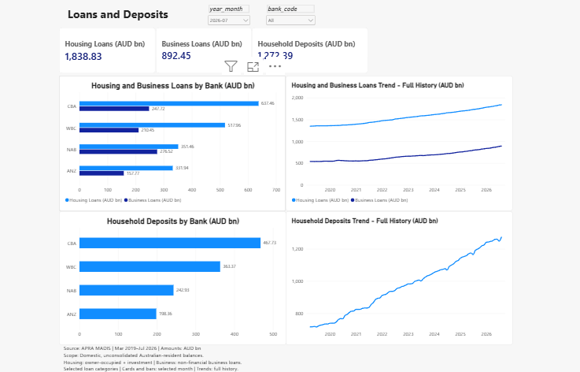

# Power BI Loans & Deposits

The second report page was accepted on 16 September 2026. It contains three
validated balance measures, two bank comparisons, two full-history charts,
month/bank dropdowns and source/definition notes. The report author confirmed
the final interaction, endpoint and save checks. [Macro Context](power_bi_macro_context.md)
was also accepted on 16 September 2026; capital/liquidity reporting remains in progress.

## Data and definitions

This page uses `fact_bank_monthly`, `dim_bank` and `dim_date`. There are four
banks at each of 89 month ends, March 2019 through July 2026. The APRA MADIS
snapshot describes Australian-resident balances on domestic, unconsolidated
books. It does not represent global consolidated banking-group balances.
Source amounts remain in AUD million; these report measures divide by 1,000
to display AUD billion. See the [monthly fact dictionary](fact_bank_monthly.md).

| Measure and checked query | Source field / definition |
|---|---|
| [Housing Loans (AUD bn)](../powerbi/dax/06_housing_loans.dax) | `owner_occupied_loans_million` plus `investment_loans_million`: household owner-occupied and investment housing loans |
| [Business Loans (AUD bn)](../powerbi/dax/07_business_loans.dax) | `business_loans_million`: loans to non-financial businesses |
| [Household Deposits (AUD bn)](../powerbi/dax/08_household_deposits.dax) | `household_deposits_million`: deposits by households |

All three measures use `fact_bank_monthly` as the home table and find the
latest fact reporting date inside the current bank/date filters. They sum
selected-bank balances at that date and convert the amount to AUD billion.
They do not sum balances over multiple reporting months. A period with no
fact records returns BLANK. With no month selected, the cards show the latest
available month. Every bank/month and each selected amount is populated in
this fixed snapshot; recheck this assumption for any future refresh.

The two loan categories are selected components and do not exhaust total
loans. Household deposits are a subset of Total Deposits. The monthly MADIS
scope also differs from the quarterly ADI highest-consolidation-level data;
the shared bank key alone does not make those amounts directly comparable.

## Page configuration

Tab name: **Loans & Deposits**. Visible heading: **Loans and Deposits**.

| Visual | Fields and settings |
|---|---|
| Month dropdown | `dim_date[year_month]`; default `2026-07` |
| Bank dropdown | `dim_bank[bank_code]`; default All |
| Three cards | One of the three measures each; `#,##0.00`, display units None |
| Housing and Business Loans by Bank (AUD bn) | Clustered bar; Y `dim_bank[bank_code]`, X Housing Loans and Business Loans; same amount axis, light blue housing and dark blue business, legend On |
| Household Deposits by Bank (AUD bn) | Bar; same bank field, X Household Deposits; blue bars, legend Off |
| Housing and Business Loans Trend - Full History (AUD bn) | Line; raw `dim_date[month_end_date]` on continuous ascending X, both loan measures on one shared Y-axis, matching colours and legend On |
| Household Deposits Trend - Full History (AUD bn) | Same raw date axis; Household Deposits on Y, blue line, legend Off |

Cards appear above two rows: bank comparisons at the left, corresponding
histories at the right. Bank-chart data labels show two decimals with display
units None. History point labels are Off and tooltips On. Use Auto history
Y-axis bounds and retain the full March 2019-July 2026 range. The two-measure
charts need no Legend field; their static series legend comes from the measures.

| Source selector | Three cards | Both bank charts | Both histories |
|---|---|---|---|
| Month | Filter | Filter | None |
| Bank | Filter | Filter | Filter |

Select each source slicer before using Format > Edit interactions on the
target visuals. Month selection changes the point-in-time comparisons while
both histories continue through July 2026. Bank selection changes all seven
data visuals, including the histories.

Add this footer beneath the charts, using left-aligned dark-grey text:

> Source: APRA MADIS | Mar 2019–Jul 2026 | Amounts: AUD bn  
> Scope: Domestic, unconsolidated Australian-resident balances.  
> Housing: owner-occupied + investment | Business: non-financial business loans.  
> Selected loan categories | Cards and bars: selected month | Trends: full history.

## Validation and acceptance

Each numbered query 06-08 passed four checks in the report author's Power BI
model: latest All, latest ANZ, June 2026 All and February 2019 BLANK. The
expected values were independently calculated from the pinned source extract.
Numeric comparisons use an absolute tolerance of 0.00000001 AUD bn; the query
grid and report labels may round to two decimals. All three measures were
added to the model after the query checks passed.

| Measure, AUD bn | July 2026, All | June 2026, All | July 2026, ANZ |
|---|---:|---:|---:|
| Housing Loans | 1,838.83 | 1,835.53 | 331.94 |
| Business Loans | 892.45 | 885.23 | 157.77 |
| Household Deposits | 1,272.39 | 1,247.68 | 198.36 |

The July 2026 bank comparisons show:

| Bank | Housing loans, AUD bn | Business loans, AUD bn | Household deposits, AUD bn |
|---|---:|---:|---:|
| CBA | 637.46 | 247.72 | 467.73 |
| WBC | 517.96 | 210.45 | 363.37 |
| NAB | 351.46 | 276.52 | 242.93 |
| ANZ | 331.94 | 157.77 | 198.36 |

Individual displayed values are rounded; the cards aggregate unrounded
amounts before display. Screenshots confirmed all twelve bank labels.
On 16 September 2026 the report author explicitly confirmed that June/All
updates the cards and bank charts while retaining complete histories, and
July/ANZ filters the bank comparisons and both histories correctly. July ANZ
and July All history endpoint values matched the corresponding table entries.
The default July/All selection was restored and the PBIX saved after adding
the footer and arranging the final layout.

This acceptance combines source-derived query checks, report screenshots and
the author's manual confirmation. It is not an automated UI test or an
independent rebuild of the entire PBIX. The preview is static; the local PBIX
remains under ignored `exports/`. Use the [rebuild guide](rebuild_power_bi.md)
to recreate the model and all three accepted pages from the versioned scripts.
