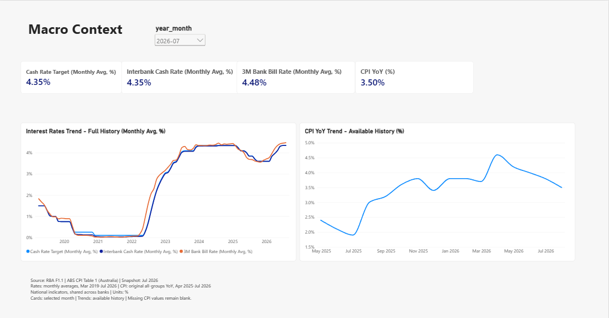

# Power BI Macro Context

The third report page was accepted on 16 September 2026. It contains four
validated national macro measures, two history charts, a month dropdown and
source/coverage notes. The report author confirmed the endpoint, date-filter,
missing-value and final save checks. Capital/liquidity reporting and the final
project release review remain in progress.

## Data and definitions

The page uses `fact_macro_monthly` and `dim_date`. The fact has one national
row per month, shared across banks, covering 89 month ends from March 2019
through July 2026. There is no bank key or bank-to-macro relationship.
Its calendar matches the monthly banking snapshot; it does not represent a
live feed or the latest national release. See the
[monthly macro fact dictionary](fact_macro_monthly.md).

| Measure and checked query | Source field | Published source series |
|---|---|---|
| [Cash Rate Target (Monthly Avg, %)](../powerbi/dax/09_cash_rate_target.dax) | `cash_rate_target_pct` | RBA F1.1 `FIRMMCRT` |
| [Interbank Cash Rate (Monthly Avg, %)](../powerbi/dax/10_interbank_cash_rate.dax) | `interbank_cash_rate_pct` | RBA F1.1 `FIRMMCRI`, interbank overnight cash rate |
| [3M Bank Bill Rate (Monthly Avg, %)](../powerbi/dax/11_bank_bill_3m.dax) | `bank_bill_3m_pct` | RBA F1.1 `FIRMMBAB90`, three-month bank accepted bills/negotiable certificates of deposit |
| [CPI YoY (%)](../powerbi/dax/12_cpi_yoy.dax) | `cpi_yoy_pct` | ABS monthly Table 1 `A130393721F`, Australia Original All groups CPI change from the corresponding month of the previous year |

All four measures use `fact_macro_monthly` as their home table. Each finds
the latest fact reporting date inside the current date context, retrieves
that month's source observation and divides source per-cent units by 100
once. The numeric fraction uses format `0.00%`: source 4.35 becomes 0.0435
and displays 4.35%. The measures do not sum rates across months or banks.
With no month filter, they use the latest fact month. A selected period with
no fact records returns BLANK.

The three RBA inputs are published monthly averages, not month-end spot
rates. All three have complete coverage over these 89 report months. The
CPI input is a published annual percentage change for each monthly
observation, not a monthly-average rate. This pinned CPI YoY series is
available for 16 months, April 2025-July 2026; the other 73 fact months stay
NULL. A month with no published CPI YoY returns BLANK even when other macro
fields exist. Do not replace it with zero, another month's value or quarterly
CPI, or recalculate it from the rounded CPI index.

The source files are `03_RBA_F1_1_Monthly_Money_Market.xlsx` and
`04_ABS_CPI_Table1_Monthly_Jul2026.xlsx` under local `data/raw/`. The RBA
series IDs are in `Data!B11`, `C11` and `I11`; the ABS series ID is in
`Data1!K10`. Source metadata, staging rules and original audit results are
documented in the [RBA source review](rba_source_review.md),
[RBA staging guide](rba_staging.md),
[ABS monthly source review](abs_cpi_monthly_source_review.md) and
[ABS monthly staging guide](abs_cpi_monthly_staging.md).

## Page configuration

Tab name and visible heading: **Macro Context**.

| Visual | Fields and settings |
|---|---|
| Month dropdown | `dim_date[year_month]`; default `2026-07` |
| Four cards | One of the four measures each; percentage with two decimal places and display units None |
| Interest Rates Trend - Full History (Monthly Avg, %) | Line; raw `dim_date[month_end_date]` on continuous ascending X; all three rate measures on one shared primary Y-axis; legend On |
| CPI YoY Trend - Available History (%) | Line; same raw date axis; CPI YoY on Y, blue series, legend Off |

Place the four cards above the two charts, with interest rates on the left
and CPI on the right. Align chart tops and heights. Use automatic X and Y
range bounds, percentage Y-axis labels, point labels Off and tooltips On.
The rate chart uses light blue for the target, dark blue for interbank and
orange for bank bills. The two cash-rate curves may overlap. Keep the
Legend field well and Secondary Y-axis empty: multiple measures provide the
rate chart's series labels. Use the raw date field, not Date Hierarchy.

Set the four model measures to Percentage with two decimals or Custom
`0.00%`. Inspect General > Data format for each plotted measure if a visual
still shows fractions such as 0.04; visual formatting can override model
formatting. Keep display units None. No further scaling is needed.

The page has no bank selector. Select the month slicer and use Format >
Edit interactions to apply Filter to all four cards and None to both
history charts. Explicitly check incoming interactions when copying a
chart. Interest-rate history retains March 2019-July 2026 and CPI retains
April 2025-July 2026 when the selected card month changes.

Add this footer beneath both charts, in left-aligned dark-grey text:

> Source: RBA F1.1 | ABS CPI Table 1 (Australia) | Snapshot: Jul 2026  
> Rates: monthly averages, Mar 2019-Jul 2026 | CPI: original all-groups YoY, Apr 2025-Jul 2026  
> National indicators, shared across banks | Units: %  
> Cards: selected month | Trends: available history | Missing CPI values remain blank.

## Validation and acceptance

Files 09-11 each passed five DAX checks in the author's Power BI model;
file 12 passed six. The expected values were independently read from the
pinned original workbooks. All four measures were then added to the model.

| Query | Accepted snapshot checks |
|---|---|
| 09 Cash Rate Target | Latest All and ANZ 4.35%; May 2026 4.31%; February 2019 and August 2026 BLANK |
| 10 Interbank Cash Rate | Latest All and ANZ 4.35%; August 2025 3.69%; February 2019 and August 2026 BLANK |
| 11 3M Bank Bill Rate | Latest All and ANZ 4.48%; June 2026 4.46%; February 2019 and August 2026 BLANK |
| 12 CPI YoY | Latest All and ANZ 3.50%; June 2026 3.80%; April 2025 2.40%; March 2025 and August 2026 BLANK |

All/ANZ checks establish that a bank filter leaves these national series
unchanged. In August 2025 the cash-rate target is 3.70% while the interbank
rate is 3.69%, providing a distinct-value check of the selected source
column. The DAX comparisons use an absolute tolerance of 0.0000000001 on
numeric fractions and distinguish BLANK from zero. `FORMAT` is used only
for readable query result columns, not the model measures themselves.

| Measure | July 2026 card and history endpoint | June 2026 card |
|---|---:|---:|
| Cash Rate Target | 4.35% | 4.35% |
| Interbank Cash Rate | 4.35% | 4.35% |
| 3M Bank Bill Rate | 4.48% | 4.46% |
| CPI YoY | 3.50% | 3.80% |

For final page acceptance, hover the first rate observation for March 2019
and the last for July 2026, checking its three values against the table.
Check CPI's first point at April 2025, 2.40%, and its last at July 2026,
3.50%. Source cells for the July rates are `Data!B697`, `C697` and `I697`;
June rates are `B696`, `C696` and `I696`. The CPI checks use `Data1!K23`,
`K37` and `K38`, with `K22` blank for March 2025.

Select June 2026: cards must match the June column while both histories
remain unchanged through July. Select March 2025: the CPI card must show
BLANK or a missing-value placeholder, while both histories remain unchanged.
Restore July 2026, clear chart selections, move the pointer off the visuals
and save the PBIX. The author explicitly confirmed all these checks passed
and July was restored and saved on 16 September 2026.

This acceptance combines source-derived DAX checks, report screenshots and
the author's manual confirmation. It is not an automated UI test or a full
independent reconstruction of the PBIX. The preview is a static screenshot;
the local PBIX stays under ignored `exports/`. Use the
[Power BI rebuild guide](rebuild_power_bi.md) to recreate all three accepted
pages from the versioned scripts.
