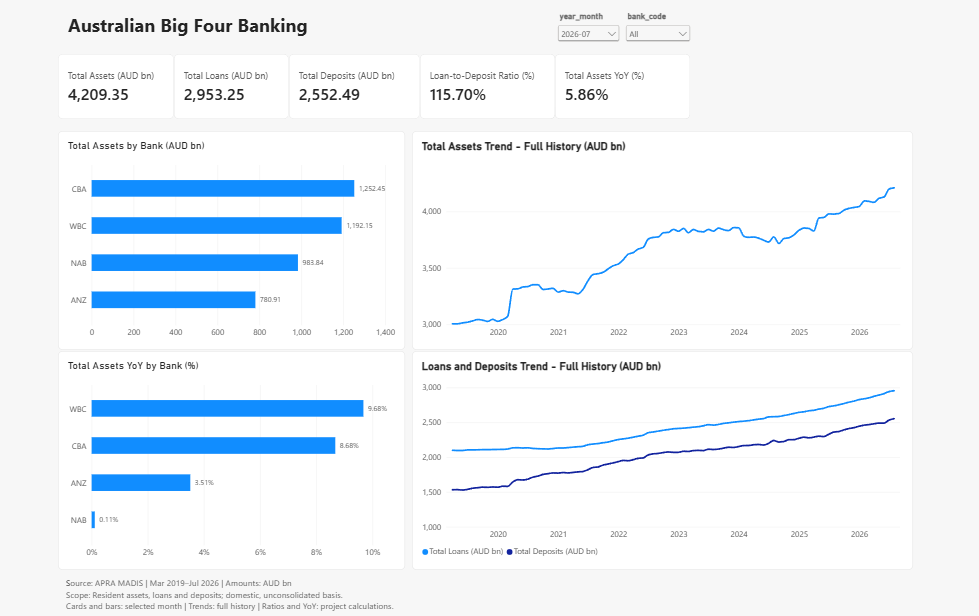

# Power BI Overview

The first report page was completed on 15 September 2026. It combines five
validated measures, two bank comparisons, two history charts, month and bank
selectors, and a source/scope footer. Final visual interaction and save checks
were confirmed by the report author. The other three planned pages are also accepted; the final release review remains in progress.

## Data and reporting scope

The page uses `fact_bank_monthly`, `dim_bank` and `dim_date`. The monthly fact
contains four banks across 89 month ends, March 2019 through July 2026.
The selected APRA MADIS fields describe residents' assets, loans and finance
leases, and deposits on the relevant institutions' unconsolidated Australian
domestic books. They are not global consolidated banking-group amounts.
Source values are AUD million; the three balance measures divide by 1,000.

The [APRA MADIS back-series](https://www.apra.gov.au/news-and-publications/monthly-authorised-deposit-taking-institution-statistics)
starts in March 2019. The wider daily date dimension does not create earlier
banking observations. Older MBS data would require a separate comparability
review before extending this page. See the [monthly fact scope](fact_bank_monthly.md).

## Measure definitions

All measures belong to `fact_bank_monthly`. Run the files in order when rebuilding.

| Measure and query | Definition | Display format |
|---|---|---|
| [Total Assets (AUD bn)](../powerbi/dax/01_total_assets.dax) | Selected banks' assets at the latest available fact date within the current filters, divided by 1,000 | `#,##0.00` |
| [Total Loans (AUD bn)](../powerbi/dax/02_total_loans.dax) | Same endpoint rule, using residents' loans and finance leases | `#,##0.00` |
| [Total Deposits (AUD bn)](../powerbi/dax/03_total_deposits.dax) | Same endpoint rule, using residents' deposits | `#,##0.00` |
| [Loan-to-Deposit Ratio (%)](../powerbi/dax/04_loan_to_deposit_ratio.dax) | Aggregate selected-bank loans divided by aggregate selected-bank deposits | `0.00%` |
| [Total Assets YoY (%)](../powerbi/dax/05_total_assets_yoy.dax) | Current assets divided by the exact prior-year same-month assets, minus one | `0.00%` |

Balances are summed across banks at a common date, not across reporting months.
All four banks are present at every month in this snapshot; future refreshes
must recheck that coverage assumption. A year or unfiltered card returns the
latest available reporting month in its filter context. No matching observation
returns BLANK.

Both ratios remain numeric fractions. The loan-to-deposit ratio and asset YoY
are project calculations; they are not sums or simple averages of the bank
percentages. The YoY calculation removes date filters for its prior-period
lookup while retaining bank filters, uses `EOMONTH(current date, -12)`, and
returns BLANK for a missing comparison or zero denominator. February 2021 thus
compares with February 29, 2020. The first twelve source months have no YoY
comparison; March 2020 is the first calculable month.

## Page configuration

| Visual | Fields / settings |
|---|---|
| Month dropdown | `dim_date[year_month]`; default `2026-07` |
| Bank dropdown | `dim_bank[bank_code]`; default All |
| Five cards | One measure each from the table above; display units None |
| Total Assets by Bank (AUD bn) | Clustered bar; Y `dim_bank[bank_code]`, X Total Assets; descending by amount |
| Total Assets YoY by Bank (%) | Clustered bar; same bank field, X Total Assets YoY; descending by growth |
| Total Assets Trend - Full History (AUD bn) | Line; raw `dim_date[month_end_date]` on a continuous ascending X-axis, Total Assets on Y |
| Loans and Deposits Trend - Full History (AUD bn) | Same date axis; both balance measures on one shared Y-axis; two colours and legend On |

Bar labels use two decimals. Amounts use the numeric format above, percentage
labels use `0.00%`, and display units remain None. Both history charts retain
their full available date range. Their point labels are Off; tooltips expose
the exact monthly amounts. The final layout places the bar charts on the left
and the history charts on the right, below the five cards.

| Source selector | Cards | Both bar charts | Both history charts |
|---|---|---|---|
| Month | Filter | Filter | None |
| Bank | Filter | Filter | Filter |

Set these incoming interactions explicitly through Format > Edit interactions.
Add the following footer as a text box beneath the charts:

> Source: APRA MADIS | Mar 2019–Jul 2026 | Amounts: AUD bn  
> Scope: Resident assets, loans and deposits; domestic, unconsolidated basis.  
> Cards and bars: selected month | Trends: full history | Ratios and YoY: project calculations.

## Validation and acceptance

The model checks confirmed all six loaded table counts, all three date-label
sort properties and the six known missing-value counts. Each balance measure
and the loan-to-deposit ratio passed three explicit value/filter checks. Asset
YoY passed five checks, including missing prior history and leap-year month-end
handling. Query results use unrounded numeric tolerances; the result grid can
display fewer decimals without changing the comparison.

| Card | July 2026, All | June 2026, All | July 2026, ANZ |
|---|---:|---:|---:|
| Assets (AUD bn) | 4,209.35 | 4,199.52 | 780.91 |
| Loans (AUD bn) | 2,953.25 | 2,940.45 | 529.01 |
| Deposits (AUD bn) | 2,552.49 | 2,531.61 | 438.31 |
| Loan-to-deposit ratio | 115.70% | 116.15% | 120.70% |
| Asset YoY | 5.86% | 5.55% | 3.51% |

The report author confirmed the final June/All and July/ANZ interaction tests,
including both bank charts and both history charts. July ANZ tooltips matched
assets 780.91, loans 529.01 and deposits 438.31 AUD bn. The default July/All
selection was restored and the PBIX saved. The final acceptance is based on
that explicit confirmation, together with earlier measure-result and visual
screenshots; it is not an automated browser test or a fresh PBIX inspection.

At July/All, the asset bars display CBA 1,252.45, WBC 1,192.15, NAB 983.84 and
ANZ 780.91 AUD bn. The growth chart displays WBC 9.68%, CBA 8.68%, ANZ 3.51%
and NAB 0.11%. All four growth labels were observed in the report; only ANZ's
individual rate is independently included in the fixed-snapshot DAX checks.
No complete value-by-value Power BI reconciliation is claimed.

## Remaining work

The local PBIX is stored under the ignored `exports/` directory. This repository
checkpoint includes the static preview, query text and manual rebuild guide;
it does not publish an interactive report or distribute the raw workbooks.
The [Loans & Deposits](power_bi_loans_deposits.md), [Macro Context](power_bi_macro_context.md)
and [Capital & Liquidity](power_bi_capital_liquidity.md) pages are also accepted.
Their source scopes and aggregation rules are documented separately.
Further interpretation of the findings and the final end-to-end release
review remain in progress.

References: [Power BI DAX query view](https://learn.microsoft.com/en-us/power-bi/transform-model/dax-query-view),
[visual interactions](https://learn.microsoft.com/en-us/power-bi/create-reports/service-reports-visual-interactions),
[custom numeric formats](https://learn.microsoft.com/en-us/power-bi/create-reports/desktop-custom-format-strings).
